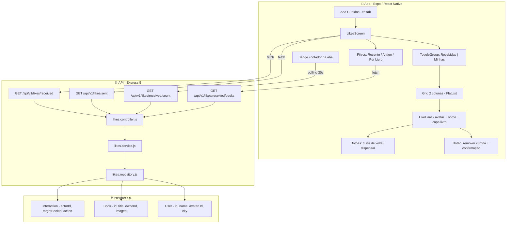
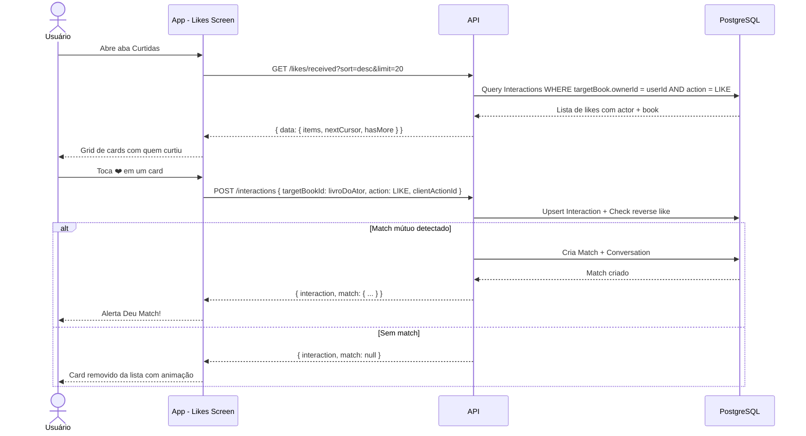
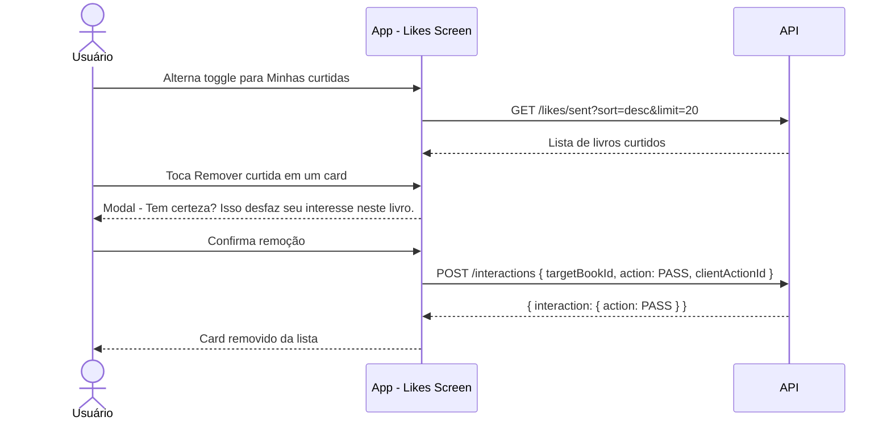
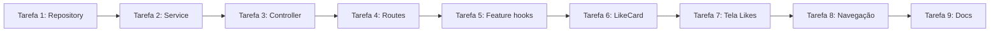

# Plano 006 — Tela de Curtidas (Likes recebidos e enviados)

- Status: IMPLEMENTADO — CORREÇÕES TÉCNICAS REVALIDADAS; ACEITE VISUAL PENDENTE
- Tipo: MOBILE / API / DOCUMENTAÇÃO
- Prioridade: ALTA
- Data de criação: 24/09/2026
- Escopo: criar tela de Curtidas estilo Tinder como 5ª aba da navegação, com visualização de curtidas recebidas e enviadas, ações de curtir de volta / dispensar / remover curtida, badge de notificação e filtros

> **Para agentes de implementação:** usar `superpowers:subagent-driven-development` (recomendado) ou `superpowers:executing-plans` para executar este plano tarefa por tarefa. Marque cada etapa com checkbox (`- [ ]`) e faça uma verificação independente ao final de cada tarefa.

## Resultado da execução em 24/09/2026

## Revisão técnica em 24/09/2026

A revisão identificou e corrigiu dois defeitos antes do aceite visual:

- O contrato da API retorna items, nextCursor e hasMore, enquanto a lista infinita do app consome items e pageInfo. O cliente agora converte o cursor da API para o tipo paginado interno usado pelas telas.
- A ação de responder a uma curtida recebida tentava interagir com o livro do próprio usuário, o que a API rejeita como SELF_INTERACTION. A resposta agora inclui o primeiro livro disponível de quem curtiu; curtir de volta e dispensar usam esse livro. Quando não há livro disponível, o card explica a indisponibilidade e omite as ações.
- A execução de testes anterior registrada abaixo é histórica. Revalidação em 24/09/2026: teste da API de Curtidas (5 testes) e teste do app (3 testes) passaram; typecheck do app passou. O aceite visual continua pendente.

- [x] Tarefas 1–4 (Backend): módulo `API/src/modules/likes/` implementado (repository, service, controller, schemas, routes) e montado em `/api/v1/likes`.
- [x] Tarefas 5–8 (Frontend): tipos em `likes.ts`, cliente em `likesApi.ts`, componente `LikeCard`, tela `Likes` e navegação de 5 abas atualizada em `main-tabs.custom.tsx` e `main-tabs.ios.tsx`.
- [x] Tarefa 9 (Documentação): `03-frontend-mobile.md`, `05-contrato-api.md` e `16-historico-de-alteracoes.md` atualizados.
- [x] Testes automatizados: vitest API com 166 testes passando (incluindo `likes.service.test.js`); vitest app com 35 testes passando (incluindo `likesApi.test.ts`); typecheck do TypeScript 100% aprovado sem erros (`tsc --noEmit`).

**Objetivo:** permitir que o usuário visualize quem curtiu seus livros, podendo curtir de volta (gerando match), dispensar ou verificar seus próprios likes enviados e desfazê-los. A aba terá um badge com a contagem de curtidas pendentes (não respondidas).

**Arquitetura:** o backend receberá 4 novos endpoints em `/api/v1/likes/` seguindo o padrão existente (Rota → Controller → Service → Repository com Zod). O frontend consumirá via TanStack Query (`useInfiniteQuery` para listas paginadas, `useQuery` para contagem). As ações de curtir de volta, dispensar e remover curtida reutilizam o endpoint existente `POST /api/v1/interactions` com upsert.

**Stack:** Expo 57, React Native 0.86, TypeScript, React Navigation, TanStack Query, Axios, Express 5, Zod, Prisma 6.

**Especificação:** regras existentes em `docs/README.md`, `docs/01-visao-geral.md`, `docs/02-arquitetura.md`, `docs/03-frontend-mobile.md`, `docs/04-backend-api.md`, `docs/05-contrato-api.md`, `docs/06-banco-de-dados.md`, `docs/09-design-system-components.md`, `docs/14-execucao-do-mvp.md` e `docs/16-historico-de-alteracoes.md`.

**Referência visual:** a tela segue o estilo do Tinder (grid 2 colunas, badge com contagem, toggle para alternar entre recebidas/enviadas).

## Decisões de produto e escopo

- A aba "Curtidas" será a **5ª aba** posicionada entre "Descobrir" e "Biblioteca" (centro da barra, como no Tinder).
- A tela padrão mostra **curtidas recebidas** (quem curtiu meus livros). Um toggle no topo alterna para **minhas curtidas** (livros que eu curti).
- Cada card exibe a **capa do primeiro livro** como fundo, com **avatar arredondado + nome do usuário** no topo do card.
- Nas curtidas recebidas: botões de **curtir de volta** (❤️) e **dispensar** (✕) diretamente no card. Curtir de volta pode gerar match instantâneo.
- Nas curtidas enviadas: botão de **remover curtida** com modal de confirmação antes de executar.
- O **badge** na aba conta curtidas pendentes — curtidas recebidas onde o usuário ainda NÃO respondeu com LIKE ou PASS a nenhum livro do ator.
- Filtros disponíveis: ordenação (mais recentes / mais antigos) e filtro por livro específico (dropdown com livros do usuário que possuem curtidas).
- A remoção de curtida (unlike) utiliza o endpoint existente `POST /api/v1/interactions` reenviando com `action: "PASS"` (upsert converte LIKE → PASS).
- Não há algoritmo de recomendação — fora do escopo do MVP.

## Arquitetura da feature



## Tarefas

### Fase 1 — Backend (API)

#### Tarefa 1: Criar Likes Repository

> Arquivo: `API/src/repositories/likes.repository.js`

- [x] Criar `findReceivedLikes(userId, { cursor, limit, sort, bookId })` — busca interações onde `action = LIKE` e `targetBook.ownerId = userId`, filtrando opcionalmente por `bookId`, com paginação por cursor e ordenação
- [x] Criar `findSentLikes(userId, { cursor, limit, sort })` — busca interações onde `actorId = userId` e `action = LIKE`, com paginação por cursor
- [x] Criar `countPendingReceivedLikes(userId)` — conta likes recebidos onde o usuário ainda NÃO respondeu com LIKE ou PASS a nenhum livro do ator (sem `Interaction` reversa)
- [x] Criar `findUserBooksWithLikes(userId)` — lista os livros do usuário que possuem pelo menos 1 like recebido (para o dropdown de filtro)

Queries Prisma esperadas:

```js
// Curtidas recebidas: quem curtiu meus livros
prisma.interaction.findMany({
  where: {
    action: 'LIKE',
    targetBook: { ownerId: userId },
    ...(bookId && { targetBookId: bookId }),
  },
  include: {
    actor: { select: { id: true, name: true, avatarUrl: true, city: true } },
    targetBook: {
      select: {
        id: true,
        title: true,
        images: { take: 1, orderBy: { position: 'asc' } },
      },
    },
  },
  orderBy: { createdAt: sort },  // 'desc' ou 'asc'
  take: limit + 1,
  ...(cursor && { cursor: { id: cursor }, skip: 1 }),
})

// Curtidas enviadas: livros que eu curti
prisma.interaction.findMany({
  where: {
    actorId: userId,
    action: 'LIKE',
  },
  include: {
    targetBook: {
      select: {
        id: true,
        title: true,
        owner: { select: { id: true, name: true, avatarUrl: true, city: true } },
        images: { take: 1, orderBy: { position: 'asc' } },
      },
    },
  },
  orderBy: { createdAt: sort },
  take: limit + 1,
  ...(cursor && { cursor: { id: cursor }, skip: 1 }),
})

// Contagem de pendentes (sem resposta reversa)
prisma.$queryRaw`
  SELECT COUNT(*)::int AS count FROM "Interaction" i
  JOIN "Book" b ON b.id = i."targetBookId"
  WHERE i.action = 'LIKE'
    AND b."ownerId" = ${userId}
    AND NOT EXISTS (
      SELECT 1 FROM "Interaction" rev
      JOIN "Book" rb ON rb.id = rev."targetBookId"
      WHERE rev."actorId" = ${userId}
        AND rb."ownerId" = i."actorId"
    )
`

// Livros do usuário que possuem pelo menos 1 like
prisma.book.findMany({
  where: {
    ownerId: userId,
    interactions: { some: { action: 'LIKE' } },
  },
  select: { id: true, title: true },
  orderBy: { title: 'asc' },
})
```

---

#### Tarefa 2: Criar Likes Service

> Arquivo: `API/src/services/likes.service.js`

- [x] Criar `getReceivedLikes(userId, query)` — chama repository, monta cursor de paginação (`hasMore` + `nextCursor`), serializa resposta
- [x] Criar `getSentLikes(userId, query)` — chama repository, monta cursor de paginação, serializa resposta
- [x] Criar `getReceivedLikesCount(userId)` — retorna `{ count: number }`
- [x] Criar `getUserBooksWithLikes(userId)` — retorna lista resumida de livros para filtro

Padrão de resposta paginada (consistente com o projeto):

```js
// Exemplo de serialização no service
const items = rows.slice(0, limit)
const hasMore = rows.length > limit
const nextCursor = hasMore ? items[items.length - 1].id : null

return {
  items: items.map(serializeLike),
  nextCursor,
  hasMore,
}
```

---

#### Tarefa 3: Criar Likes Controller

> Arquivo: `API/src/controllers/likes.controller.js`

- [x] Criar `listReceivedLikes(req, res)` — valida query params com Zod, chama service, retorna `{ data: { items, nextCursor, hasMore } }`
- [x] Criar `listSentLikes(req, res)` — valida query params com Zod, chama service
- [x] Criar `getReceivedLikesCount(req, res)` — chama service, retorna `{ data: { count } }`
- [x] Criar `listBooksWithLikes(req, res)` — para o dropdown de filtro

Schema Zod para query params:

```js
import { z } from 'zod'

export const likesQuerySchema = z.object({
  cursor: z.string().uuid().optional(),
  limit: z.coerce.number().int().min(1).max(50).default(20),
  sort: z.enum(['desc', 'asc']).default('desc'),
  bookId: z.string().uuid().optional(),  // só para recebidas
})
```

---

#### Tarefa 4: Criar Likes Routes e registrar no router principal

> Arquivos: `API/src/routes/likes.routes.js` (novo) + `API/src/routes/index.js` (modificar)

Rotas (todas privadas — requerem `Authorization: Bearer <accessToken>`):

| Método | Rota | Controller | Descrição |
|---|---|---|---|
| `GET` | `/api/v1/likes/received` | `listReceivedLikes` | Curtidas recebidas com paginação |
| `GET` | `/api/v1/likes/sent` | `listSentLikes` | Curtidas enviadas com paginação |
| `GET` | `/api/v1/likes/received/count` | `getReceivedLikesCount` | Contagem para badge |
| `GET` | `/api/v1/likes/received/books` | `listBooksWithLikes` | Livros para filtro |

- [x] Criar `API/src/routes/likes.routes.js` com as 4 rotas acima
- [x] Importar e registrar em `API/src/routes/index.js` com `router.use('/likes', likesRouter)`

---

### Fase 2 — Frontend (App)

#### Tarefa 5: Criar Likes Feature (hooks e API client)

> Diretório: `app/src/features/likes/`

- [x] Criar `likesApi.ts` com funções de chamada à API:
  - `fetchReceivedLikes(params)` → `GET /likes/received`
  - `fetchSentLikes(params)` → `GET /likes/sent`
  - `fetchReceivedLikesCount()` → `GET /likes/received/count`
  - `fetchBooksWithLikes()` → `GET /likes/received/books`
  - `interact(params)` → `POST /interactions`
- [x] Criar tipos em `app/src/types/likes.ts` (`ReceivedLike`, `SentLike`, `LikeBook`)
- [x] Configurar queries React Query com TanStack Query:
  - `useReceivedLikes` (`useInfiniteQuery` com paginação por cursor)
  - `useSentLikes` (`useInfiniteQuery` com paginação por cursor)
  - `useReceivedLikesCount` (`useQuery` com `refetchInterval: 30_000`)
  - `useBooksWithLikes` (`useQuery`)
  - Ações de curtir de volta, dispensar e unlike via `useMutation` com invalidação de cache

---

#### Tarefa 6: Criar Componente LikeCard

> Arquivos: `app/src/components/LikeCard/index.tsx` + `styles.ts`

Layout visual do card:

```
┌─────────────────────┐
│ 🟢 Avatar  Nome     │  ← Topo: avatar arredondado pequeno + nome do usuário
│                     │
│                     │
│   📚 Capa do Livro  │  ← Centro: imagem da capa do livro como background
│   (ImageBackground) │
│                     │
│                     │
│  "Título do Livro"  │  ← Inferior: título do livro + cidade (sobre gradiente)
│  📍 Cidade          │
│                     │
│  ❤️  ✕              │  ← Ações (só em variant='received')
└─────────────────────┘
```

Props TypeScript:

```ts
interface LikeCardProps {
  user: { id: string; name: string; avatarUrl?: string; city?: string }
  book: { id: string; title: string; coverUrl?: string }
  likedAt: string
  variant: 'received' | 'sent'
  onLikeBack?: () => void     // só para variant='received'
  onDismiss?: () => void      // só para variant='received'
  onUnlike?: () => void       // só para variant='sent'
  onPress?: () => void        // navegar para detalhes
}
```

- [x] Usar `ImageBackground` para a capa do livro como fundo do card
- [x] Usar componente `Avatar` existente (com fallback para iniciais) no topo
- [x] Gradiente inferior com `expo-linear-gradient` para legibilidade do texto
- [x] Botões de ação com ícones `MaterialIcons` (`favorite` e `close`)
- [x] Animação de feedback ao curtir/dispensar (scale ou opacity)
- [x] Seguir tokens do design system (`theme.ts`) para cores, espaçamentos e tipografia (Be Vietnam Pro)

---

#### Tarefa 7: Criar Tela Likes (Curtidas)

> Arquivos: `app/src/pages/Likes/index.tsx` + `styles.ts`

Estrutura da tela:

```
┌──────────────────────────────┐
│  Curtidas  (9)               │  ← TopBar com título + badge de contagem
├──────────────────────────────┤
│  [Curtidas recebidas] [Minhas curtidas]  │  ← ToggleGroup
├──────────────────────────────┤
│  ▾ Mais recentes  │  📚 Todos │  ← Filtros (dropdown de ordenação + livro)
├──────────────────────────────┤
│  ┌─────┐  ┌─────┐           │
│  │Card │  │Card │           │  ← FlatList numColumns={2}
│  │  1  │  │  2  │           │
│  └─────┘  └─────┘           │
│  ┌─────┐  ┌─────┐           │
│  │Card │  │Card │           │
│  │  3  │  │  4  │           │
│  └─────┘  └─────┘           │
│         ...                  │
└──────────────────────────────┘
```

- [x] Usar `AppScreen` como wrapper
- [x] `TopBar` com título "Curtidas" e badge de contagem total
- [x] `ToggleGroup` existente para alternar entre "Curtidas recebidas" (padrão) e "Minhas curtidas"
- [x] Dropdowns de filtro: ordenação (`desc`/`asc`) e livro específico (usando dados de `useBooksWithLikes`)
- [x] `FlatList` com `numColumns={2}` renderizando `LikeCard`
- [x] `onEndReached` + `onEndReachedThreshold` para paginação infinita (cursor-based)
- [x] `StateView` para estados vazios: "Nenhuma curtida recebida ainda" / "Você não curtiu nenhum livro ainda"
- [x] Modal de confirmação ao remover curtida na aba "Minhas curtidas" — texto: "Tem certeza? Isso desfaz seu interesse neste livro."
- [x] Pull-to-refresh com `RefreshControl`
- [x] Atualização otimista: remover card da lista imediatamente e restaurar se a requisição falhar
- [x] Ao curtir de volta e gerar match: exibir alerta "Deu match!" (consistente com o alerta da tela Discover)

---

#### Tarefa 8: Atualizar Navegação — Adicionar 5ª aba

> Arquivos a modificar:

**`app/src/routes/main-tabs.custom.tsx`** (Android/Web):

- [x] Importar `LikesScreen` de `../pages/Likes`
- [x] Adicionar aba "Curtidas" com ícone `MaterialIcons name="favorite"` entre Discover e Library
- [x] Configurar badge usando `useReceivedLikesCount()` — número com cor magenta (primária do design system)

**`app/src/routes/main-tabs.ios.tsx`** (iOS nativo):

- [x] Adicionar aba "Curtidas" com SF Symbol `heart.fill` entre Discover e Library
- [x] Badge nativo do iOS com contagem de pendentes

**`app/src/types/navigation.ts`**:

- [x] Adicionar `Likes: undefined` no `MainTabParamList`

Ordem final das 5 abas:

```
1. Descobrir   (sparkles / explore)
2. Curtidas    (heart.fill / favorite)     ← NOVA
3. Biblioteca  (books.vertical / menu-book)
4. Mensagens   (bubble / chat-bubble)
5. Perfil      (person / person)
```

---

#### Tarefa 9: Atualizar Documentação

> Arquivos a modificar:

- [x] `docs/05-contrato-api.md` — adicionar seção "Curtidas" com os 4 novos endpoints, schemas e respostas
- [x] `docs/03-frontend-mobile.md` — atualizar estrutura de navegação para 5 abas e documentar a tela Likes
- [x] `docs/16-historico-de-alteracoes.md` — registrar a nova feature com data e escopo

---

## Fluxos de interação

### Fluxo 1: Ver curtidas recebidas e curtir de volta



### Fluxo 2: Remover curtida enviada



---

## Considerações técnicas

### Reutilização do endpoint POST /interactions

Não é necessário criar endpoints novos para curtir de volta, dispensar ou remover curtida. O endpoint existente `POST /api/v1/interactions` com upsert já cobre todos esses casos:

- **Curtir de volta:** `{ targetBookId: livroDoOutroUsuário, action: "LIKE", clientActionId }`
- **Dispensar:** `{ targetBookId: livroDoOutroUsuário, action: "PASS", clientActionId }`
- **Remover curtida:** `{ targetBookId: livroOriginal, action: "PASS", clientActionId }` (converte LIKE → PASS via upsert)

### Performance do badge

O hook `useReceivedLikesCount()` faz polling a cada 30 segundos via `refetchInterval`. Para o MVP isso é suficiente. No futuro, pode ser migrado para WebSocket (evento `like:received` via Socket.IO já existente).

### Query de contagem de pendentes

A contagem de "curtidas pendentes" exige verificar se o usuário já interagiu com algum livro do ator. Isso é uma query `NOT EXISTS` com subquery. Para o MVP com volume baixo, a performance é aceitável. Se escalar, considerar:
- Adicionar campo `respondedAt` na tabela `Interaction`
- Criar uma view materializada ou tabela de cache

---

## Arquivos a criar

```
API/
├── src/
│   ├── repositories/likes.repository.js    ← NOVO
│   ├── services/likes.service.js           ← NOVO
│   ├── controllers/likes.controller.js     ← NOVO
│   └── routes/likes.routes.js              ← NOVO

app/
├── src/
│   ├── features/likes/
│   │   ├── api.ts                          ← NOVO
│   │   └── hooks.ts                        ← NOVO
│   ├── components/LikeCard/
│   │   ├── index.tsx                       ← NOVO
│   │   └── styles.ts                       ← NOVO
│   └── pages/Likes/
│       ├── index.tsx                       ← NOVO
│       └── styles.ts                       ← NOVO
```

## Arquivos a modificar

```
API/
└── src/routes/index.js                     ← Registrar likes.routes

app/
├── src/routes/main-tabs.custom.tsx         ← Adicionar 5ª aba
├── src/routes/main-tabs.ios.tsx            ← Adicionar 5ª aba (iOS)
└── src/types/navigation.ts                ← Adicionar tipo Likes

docs/
├── 03-frontend-mobile.md                  ← Navegação atualizada
├── 05-contrato-api.md                     ← Novos endpoints
└── 16-historico-de-alteracoes.md           ← Changelog
```

## Ordem de execução



| # | Tarefa | Estimativa |
|---|---|---|
| 1 | Likes Repository | ~1h |
| 2 | Likes Service | ~45min |
| 3 | Likes Controller + Zod | ~30min |
| 4 | Likes Routes + registro | ~15min |
| 5 | Feature hooks + API client | ~1h |
| 6 | Componente LikeCard | ~1.5h |
| 7 | Tela Likes completa | ~2h |
| 8 | Atualizar navegação (tabs) | ~45min |
| 9 | Atualizar documentação | ~30min |

**Total estimado: ~8 horas de desenvolvimento**
